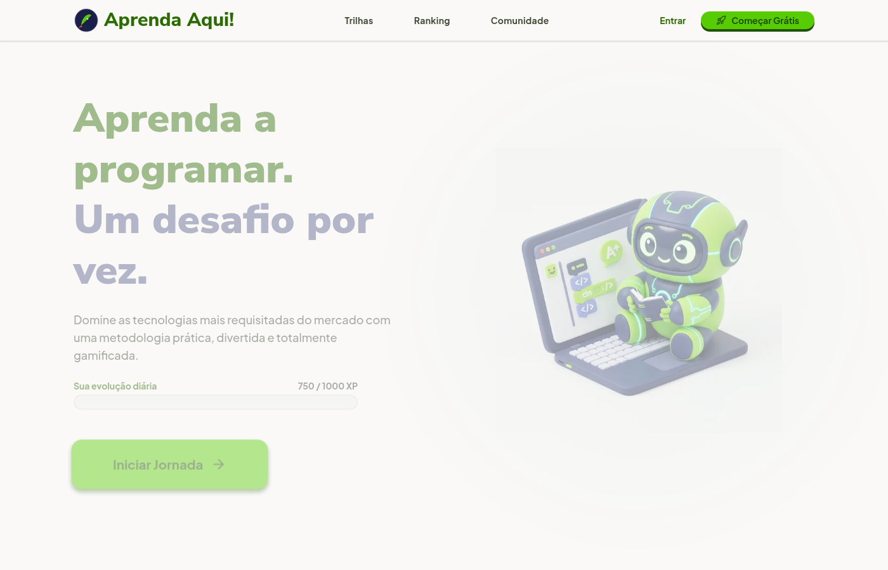

# Pôster INIC — Aprenda Aqui

Arquivos para submissão/avaliação no padrão de pôster científico (duas colunas, seções Resumo, Introdução, Material e Métodos, Resultados, Discussão, Conclusões e Referências).

## Arquivos

- `poster-aprenda-aqui.html` — layout completo (90 cm × 120 cm, retrato).
- `poster-aprenda-aqui.pdf` — exportação para impressão (gerada pelo script).
- `poster-aprenda-aqui.png` — imagem raster para compartilhamento.

## Inserir sua print

1. Abra `poster-aprenda-aqui.html` em um editor.
2. Localize o bloco `#area-print` (placeholder tracejado).
3. Substitua o conteúdo interno por uma tag ``:

```html
<div class="screenshot-placeholder" id="area-print" style="border: none; padding: 0; min-height: auto;">
  
</div>
```

4. Coloque o arquivo `sua-print.png` na pasta `inic-poster/` e regenere o PDF.

## Regenerar PDF/PNG

```bash
cd inic-poster
./export-poster.sh
```

## Referências (item 5)

A seção **Referências** já inclui estudos brasileiros (RENOTE, SBIE) e internacionais sobre gamificação no ensino de programação, em formato adequado para pôster acadêmico.

## Dados do piloto (Tabela 1)

A tabela traz indicadores **preliminares** do teste na Escola Marilda. Atualize a linha “Medição quantitativa” e demais células quando tiver números finais (notas, tempo de uso, questionários).
